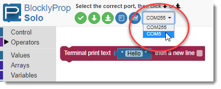

## Learning goals

- Connect Parallax activity board to a computer

- Create a simple script in blockly

- Run and save the script

## Software and hardware

- BlocklyProp Solo

- Activity Board

- Parallax USB programming cable

# Instruction 

Please follow the instructions on the website:

<https://learn.parallax.com/courses/getting-started-with-blocklyprop-solo/lessons/blocklyprop-launcher/>

- This assignment has three steps shown on the top left. Please follow the instructions for each step. Please start with the first one (BlocklyProp Launcher). You can then go to the next step either by clicking on the top left menu (Connect and Program) or simply by clicking on the menu (Connect and Program) shown at the bottom of the page. Alternatively, you can follow the steps in the *'Lab_1_Getting Started with BlocklyProp Solo.pdf'*.

Menu on the top left side of the website.

Go to the next/previous page shown at the bottom of the website.

1.  [**BlocklyProp Launcher**](https://learn.parallax.com/tutorials/language/blocklyprop/getting-started-blocklyprop-solo/blocklyprop-launcher)

    - Download and install the BlocklyProp Launcher Installer for your operating system.

    - Name your project appropriately. For instance, you may want to name it as:

> ***Lab1_YourInitials_DescriptiveName** (e.g., Lab1_AM_installingBlocklyprop)*

2.  [**Connect and Program**](https://learn.parallax.com/tutorials/language/blocklyprop/getting-started-blocklyprop-solo/connect-and-program)

    - Once you connect the USB cable, from the port dropdown menu in the software (shown below), select the COM (communication) port connected to your Propeller board.

> 

3.  [**Saving Projects**](https://learn.parallax.com/tutorials/language/blocklyprop/getting-started-blocklyprop-solo/saving-projects)

    - Pay attention to the difference between RAM and EEPROM.

    - Save your project. It is saved as \*.svg file. Every time you save the project, it adds a number at the end and saves it unless you overwrite it on the previous version.

# Notes on installation, troubleshooting, and programming

## Download the USB Driver

- Please make sure you accept default installation with FTDI drivers once you are installing BlocklyProp Solo.

- If the system doesn't detect the device connected via USB, then follow these steps:

  - Install Parallax FTDI USB Drivers

> This system requires USB Serial Drivers in order to work properly with modern Propeller-based devices. Install the Parallax USB Drivers ([included in the BlocklyProp Launcher Setup]{.underline}) before using this software. You skip this installation since it is included in the BlocklyProp Luncher Setup (Accept default installation with FTDI drivers).

- Parallax FTDI USB Drivers for Windows

> <https://www.parallax.com/package/parallax-ftdi-usb-drivers-for-windows/>

- Mac FTDI USB Driver

> <https://www.parallax.com/package/mac-ftdi-usb-driver/>
>
> **Download Summary**
>
> Parallax signed FTDI USB drivers for Windows. Always download and install the latest version (at the top of the list) unless we\'ve instructed you to choose an older version. Note that the executable (.exe) will work for most users; however, the zip archive (.zip) contains the same file and is provided for networks that prevent executable (.exe) downloads. See version history at the bottom of this page. These drivers are required for any Board of Education USB, PropScope, and other USB-based Parallax hardware (source: Parallax website).

## What is FTDI USB driver?

> FTDI USB Serial Port driver is the software that helps your operating system to communicate with USB Serial Port devices. (<https://www.dell.com/>).

- If it didn't help, then turn off the memory integrity setting on your PC and restart the system.

  - You can also open the Core isolation page by selecting **Start ** \> **Settings ** \> **Update & Security ** \> **Windows Security ** \> **Device Security** and then under **Core isolation**, selecting **Core isolation details**.

  - Turn off the memory integrity.

# Programming 

1.  Create a block of code that prints the following text in a new line in the terminal:

    - Add a comment as the first line of the code saying, 'TAE 30'.

    - Add another comment in the next line: 'Lab 1'.

      - NOTE: The comments are not printed in the terminal. Comments are used to annotate the code and make it easier to understand for yourself when you get back to your code later and also for others when you share your code with them.

    - Print the following statements, each in a new line:

      - Hello!

      - A blank line to leave a space between the first and second lines.

      - Your name (e.g., "My name is Ali Moghimi")

      - A fun statement (e.g., 'I love ice cream!')

2.  Save your code on your computer.

- A screenshot of your code and the terminal showing the printed statements. Please note the project name with your initials should be visible in the screenshot (similar to the screenshot below).

# Notes on programming 

- To add a comment, go to the Control section on the left menu \> add comment:

- To print a statement in the terminal, go to the Communicate tab on the left menu \> Terminal \> Terminal print text:

