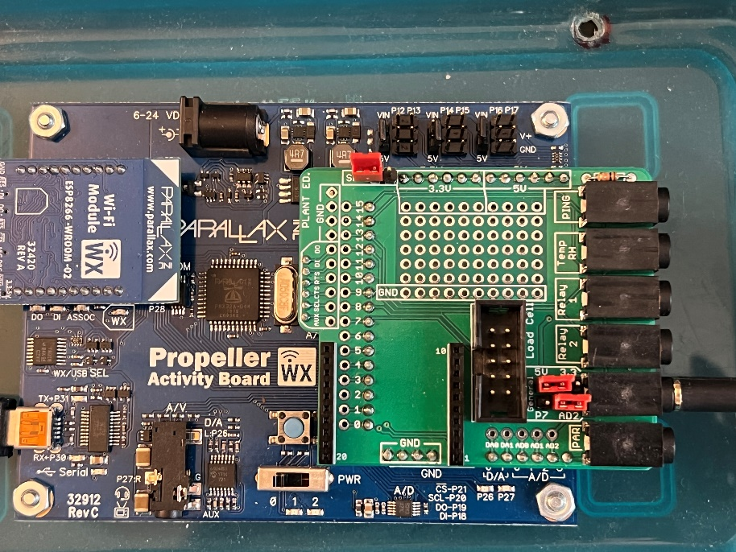

## Learning goals

- Create scripts and functions in Blockly

- Learn and practice:

  - How to measure photosynthetic light level using a **p**hotosynthetically **a**ctive **r**adiation (PAR) sensor.

  - How to measure the soil moisture using a soil moisture sensor.

  - Making decisions based on input sensor data.

## Software and hardware

- BlocklyProp Solo

- Activity Board and Parallax USB programming cable

- PAR sensor

- Soil moisture sensor

**What is PAR?**

Photosynthetically active radiation (PAR) is the most important energy source (solar radiation ranging from 400 to 700 nm) for crops, which is used by them for photosynthesis. A low or high PAR intensity can deteriorate photosynthesis; hence, it may become a stress factor.

# How to connect the soil moisture sensor

Please note the soil moisture sensor is connected to the "General" purpose socket, the one next to PAR (second from the bottom when sockets are pointing to the right), with jumpers set to "5V" and "AD2", as shown in this figure.

# Programming 

- Create a script that:

  1.  Asks users to enter a threshold for photosynthetic light level and saves it as a variable called "par_threshold".

  2.  Asks users to enter a threshold for soil moisture level and saves it as a variable called "moisture_threshold".

  3.  Reads photosynthetic light level using PAR sensor and assigns it to \"par \" variable; please note the PAR sensor is connected to AD3 (analog to digital converter).

  4.  Reads soil moisture level and assigns it to the \"moisture\" variable; please note that the soil moisture sensor is connected to AD2 (analog to digital converter).

  5.  Prints the measured value for PAR in the terminal. Please note that the output value is a unitless number without physical meaning (unit). We need to calibrate the sensor to have a physical unit (µmol/(m^2^s): millimoles of light energy per square meter per second) for the measurements.

  6.  Prints the measured value for soil moisture in the terminal. Please note that the output value is a unitless number without physical meaning (unit).

  7.  Makes decisions based on the measured PAR. If the measured PAR is less than the defined threshold, we need to turn ON our light source (e.g., a lamp). In this case, we will turn ON LED 26, assuming we are turning ON the lamp located on the top of the plants in a greenhouse.

  8.  Makes decisions based on the measured soil moisture level. If the measured soil level is less than the defined threshold, we need to turn ON our irrigation system. In this case, we will turn ON LED 27, assuming we are turning ON the irrigation system.

- Save your code on your computer periodically.

- Submit your code saved as ***LabX_YourInitials_DescriptiveName** (e.g., Lab6_AM_PAR_moisture)*

<!-- -->

- Submit your code saved as a \*.svg file.

# Code structure and hints

- The script should have two main blocks:

  - **Main block**

    - Iteration = 1

    - Get the PAR threshold in the terminal

    - Get the moisture threshold in the terminal

    - A continuous loop (use *repeat forever* block)

      - Print iteration number.

      - Call a **function** that reads the PAR sensor data and prints it in the terminal.

      - Call a **function** that reads the soil moisture data and prints it in the terminal.

      - Call a **function** that makes decisions based on PAR value.

        - If PAR value \< par_threshold:

          - Make PIN 26 high

          - Print("The light source is ON!")

        - Else:

          - Make PIN 26 low

          - Print("The light source is OFF!")

      - Call a **function** that makes decisions based on soil moisture value:

        - If moisture value \< moisture_threshold:

          - Make PIN 27 high

          - Print("The irrigation pump is ON!")

        - Else:

          - Make PIN 27 low

          - Print("The irrigation pump is OFF!")

      - Pause for 3000 ms.

      - Increment iteration variable.

      - At the end of the loop, please clear the screen (use *Terminal clear screen* block)

  - **Your function block**s

    - You have four functions make call them as:

      - par_sensor: reads the PAR sensor data

      - moisture_sensor: reads the soil moisture data

      - light_source: changes the status of light source based on the PAR data

      - irrigation_pump: changes the status of irrigation pump based on the soil moisture value.

**Useful resources**

Propeller BlocklyProp Block Reference

<https://learn.parallax.com/support/reference/propeller-blocklyprop-block-reference>

- To read sensor data, you need to use A/D channel.

  - The block is under the Analog/Pulses menu on the left side \> voltage \>

> 
