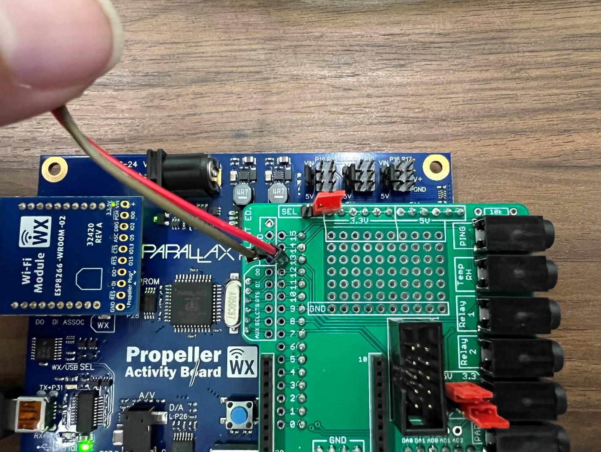

## Learning goals

- Create scripts and functions in Blockly

- Learn and practice how to control actuators, servo motors, and a pump based on the sensors' measurements.

## Software and hardware

- BlocklyProp Solo

- Activity Board and Parallax USB programming cable

- Soil moisture sensor

- Temperature/RH sensor

- Servo motor

- Pump (peristaltic pump)

- Outlet Power Relay Module

# Servo motor

The Parallax Feedback 360° High-Speed Servo provides the functionality of a light-duty standard servo, continuous rotation servo, high-speed servo, and encoder in one convenient package.

Utilizing this feedback signal, your application can cause the servo to turn to and hold any angle, much like a standard servo, but with an unlimited range of motion. Or, rotate the servo continuously at a controlled, verifiable speed---up to 120 RPM---as a robot drive motor (reference: <https://www.parallax.com/product/parallax-feedback-360-high-speed-servo)>.

Please note that the power switch of the activity board should be in position 2. You can connect the servo motor to one of the servo pins, as shown in Figure 1. Please use pins 16 and 17 and make sure the jumper is set to Vdd (regulated 5 VDC for this board). We should also provide power using a 7 Volt adaptor to supply adequate power/current for the servo (see the yellow rectangle box in Figure 1).

To learn more about controlling servo motors using the activity board and Blockly, please check this website:

<https://learn.parallax.com/support/reference/propeller-blocklyprop-block-reference/servo>

# Peristaltic pump

The pump houses a flexible tube fitted in a circular pump casing. The pump works through a rotary motion that displaces the fluid inside the tube at a constant rate by squeezing fluid against the pump housing (Figure 2).

**How to connect the pump to the relay module**

Plug in the pump cord to one of the normally OFF outlets of the power relay module.

**Outlet Power Relay Module**

The outlet Power Relay Module (EKM-Switch120) is a power cord that switches 120 AC voltage with a DC control voltage of 3.3--60 VDC, which allows it to be controlled remotely. It has three types of outlets: always ON, normally ON, and normally OFF (Figure 3).

<figure>

<figcaption>
. Power Relay Module with three types of outlets: always ON, normally ON, and normally OFF.
</figcaption>
</figure>

- Always ON: it continuously gives power when the module is powered on.

- Normally OFF: it is normally OFF. It becomes ON when the module is powered ON and the relay switch is turned ON by the activity board.

- Normally ON: it is normally ON. It becomes OFF when the relay switch is turned ON by the activity board.

**How to connect the relay module to the activity board**

Connect the relay module to 'relay 1' socket (or 'relay 2' socket) on the green custom-designed board mounted on the activity board (Figure 4).

Please note:

- Relay 1 socket is connected to pin 13.

- Relay 2 socket is connected to pin 12.

 

. A. If your relay module has a headphone jack, then connect it to the activity board by plugging it into the 'Relay 1' socket (first image on the left). B and C. If it comes with two wires (red and brown), then connect the brown wire to the GND (ground) hole as shown in the middle image, and the red wire goes into "pin 12" or "pin13" as shown in the right image.

# Programming 

In this assignment, we will practice controlling actuators, including a servo motor and a pump, based on the sensors' measurements.

+---------------------------------------------------+---------------------------------------------------------------------------+
| **Condition**                                     | **Action**                                                                |
+===================================================+===========================================================================+
| Relative humidity \> a threshold defined by users | Spin the servo motor 360° per second, assuming the motor acts like a fan. |
|                                                   |                                                                           |
|                                                   | Otherwise, set the speed to 0.                                            |
+---------------------------------------------------+---------------------------------------------------------------------------+
| Soil moisture \< a threshold defined by users     | Turn on the pump until the soil moisture returns to the desired level.    |
+---------------------------------------------------+---------------------------------------------------------------------------+

- Create a script that:

  1.  Asks users to enter a threshold for relative humidity level and saves it as a variable called "rh_threshold".

  2.  Asks users to enter a threshold for soil moisture level and saves it as a variable called "moisture_threshold".

  3.  Reads RH level in percentage using temp/RH sensor and assigns it to \"rh\" variable; please note the temp/RH sensor is connected to PIN 14.

  4.  Reads soil moisture level and assigns it to \"moisture\" variable; please note that the soil moisture sensor is connected to AD2 (analog to digital convertor).

  5.  Prints the measured value for the relative humidity (%) in the terminal.

  6.  Prints the measured value for soil moisture in the terminal. Please note that the output value is voltage (volt-100ths between 0-5).

  7.  Makes decisions based on the measured RH, according to Table 1. If the measured RH is more than the defined threshold, we need to spin the servo motor 360 degrees. We assume the motor acts like a fan to vent moisture and reduce humidity in a greenhouse.

  8.  Makes decisions based on the measured soil moisture level. If the measured soil level is less than the defined threshold, we need to turn ON our irrigation system (the pump).

# Blockly 

## Servo motor 

+--------------------------------------------------------------------------------------------------------------------------------------------------------------------------------------------------------------------------------------+--------------------------------------------------------------------------------------------------------------------------------------------------------------------------------------------------------------+
| Set the PIN dropdown to the Propeller I/O pin connected to the servo\'s control signal wire (the white wire in the 3-wire cable).                                                                                                    |     |
|                                                                                                                                                                                                                                      |                                                                                                                                                                                                              |
| Set the FB dropdown to the Propeller I/O pin connected to the servo\'s feedback signal wire (the single yellow wire).                                                                                                                |                                                                                                                                                                                                              |
+======================================================================================================================================================================================================================================+==============================================================================================================================================================================================================+
| Set the continuous rotation speed in degrees per second. Positive values turn counterclockwise and negative values turn clockwise.  When speed is chosen, insert a value block or any variable or equation that resolves to a value. |   |
+--------------------------------------------------------------------------------------------------------------------------------------------------------------------------------------------------------------------------------------+--------------------------------------------------------------------------------------------------------------------------------------------------------------------------------------------------------------+
| Provides the angular position of the specified servo.                                                                                                                                                                                |  |
+--------------------------------------------------------------------------------------------------------------------------------------------------------------------------------------------------------------------------------------+--------------------------------------------------------------------------------------------------------------------------------------------------------------------------------------------------------------+
| The Feedback 360° servo status tests whether the servo is (1/true) or is not (0/false) in the state chosen from the drop-down menu. This block does not change the servo\'s behavior but merely observes.                            |    |
+--------------------------------------------------------------------------------------------------------------------------------------------------------------------------------------------------------------------------------------+--------------------------------------------------------------------------------------------------------------------------------------------------------------------------------------------------------------+
| For more information, please check this website and scroll down to *Feedback 360° servo initialize* section:                                                                                                                         | <https://learn.parallax.com/support/reference/propeller-blocklyprop-block-reference/servo>                                                                                                                   |
+--------------------------------------------------------------------------------------------------------------------------------------------------------------------------------------------------------------------------------------+--------------------------------------------------------------------------------------------------------------------------------------------------------------------------------------------------------------+

## Peristaltic pump

- Set pin 13 (which is relay 1) high.

- If the relay module is connected to relay 2, you need to set pin 12 high.

# Code structure and hints

- You may want to work on a copy of assignment 6 (par and soil moisture sensor) since you only need to change a few parts of the code.

- The script should have five main blocks: the main block and four function blocks

  - **Main block**

    - Iteration = 1

    - Get the RH threshold in the terminal

    - Get moisture threshold in the terminal

    - A continuous loop (use *repeat forever* block)

      - Print iteration number.

      - Call a function that reads and prints the RH sensor data in the terminal.

      - Call a function that reads and prints the soil moisture data in the terminal.

      - Call a function that makes decisions based on RH value.

        - If RH value \> rh_threshold:

          - Set the servo speed to 360°/second.

          - Print("Fan is ON!")

        - Else:

          - Set the servo speed to 0°/second.

          - Print("Fan is OFF!.")

      - Call a function that makes decisions based on soil moisture value:

        - If moisture value \< moisture_threshold:

          - Make PIN 13 high (relay 1)

          - Print("The irrigation pump is ON!")

        - Else:

          - Make PIN 13 low (relay 1)

          - Print("The irrigation pump is OFF!")

      - Pause for 4000 ms.

      - Increment iteration variable.

      - At the end of the loop, please clear the screen (use *Terminal clear screen* block)

  - **Your function blocks**

    - You have four functions make call them as:

      - rh_sensor: reads the RH sensor data.

      - moisture_sensor: reads the soil moisture data.

      - servo_motor: changes the speed of the servo motor.

      - irrigation_pump: changes the status of the irrigation pump based on the soil moisture value.

<!-- -->

- Save your code on your computer periodically.

- Submit your code saved as ***LabX_YourInitials_DescriptiveName** (e.g., Lab7_AM_actuators)*

<!-- -->

- Submit your code saved as a \*.svg file.
