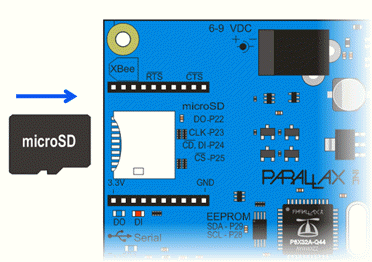
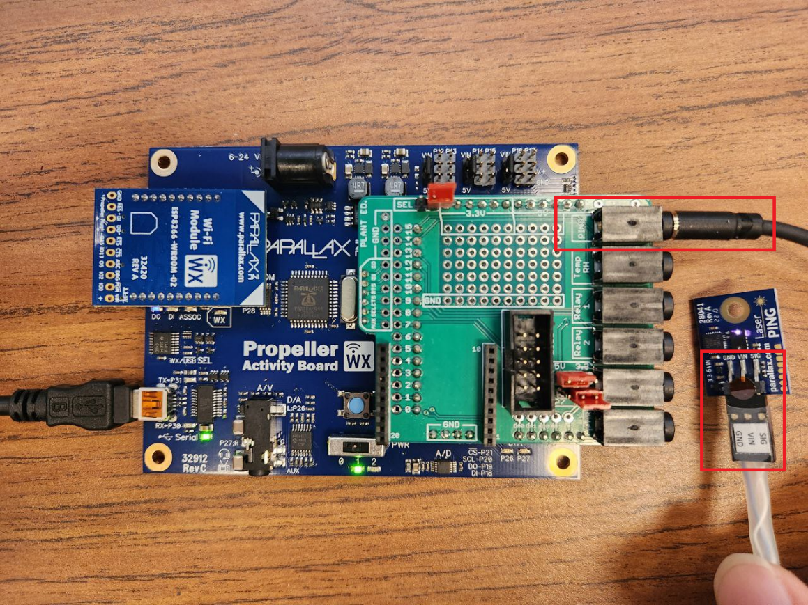
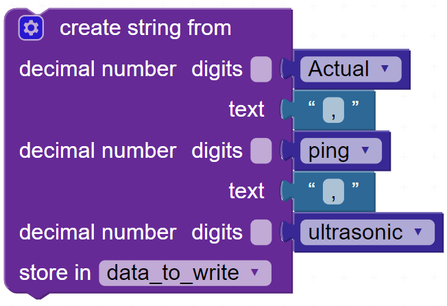
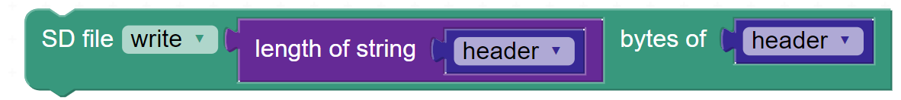

## Learning goals

- **Develop Blockly Scripts:** Create and utilize functions in Blockly for task automation and control.

- **Data Saving Techniques:** Learn how to record and save sensor data on an SD card.

- **Sensor Accuracy Comparison:** Examine and compare the accuracy of Ultrasonic vs. Laser Ping sensors for distance measurement.

- **Data Analysis in Excel:** Practice plotting actual versus measured data and calculating the coefficient of determination (R²) value to evaluate the goodness of fit of the data.

## Software and Hardware

- BlocklyProp Solo

- Activity Board and Parallax USB programming cable

- Laser Ping Sensor

- Ultrasonic Sensor

- GND -- VIN -- SIG cable

- SD Card

- SD Card Reader

- Ruler or Measuring Tape

- Excel

# SD Card Data

Your ActivityBot board (original or WX version) has a built-in card reader that is compatible with our preformatted microSD card. SD cards can give your Propeller microcontroller invention some extra gigabytes of memory to work with. In this lesson, we'll look at simple data storage and retrieval. (reference:<https://learn.parallax.com/tutorials/language/propeller-c/propeller-c-simple-devices/sd-card-data>)

  --------------------------------------------------------------------------------------------------------------------------------------------------------------------------------------------------------------------------
  
  --------------------------------------------------------------------------------------------------------------------------------------------------------------------------------------------------------------------------
  Figure 1. Buit-in card reader for microSD Card.

  --------------------------------------------------------------------------------------------------------------------------------------------------------------------------------------------------------------------------

# Laser Ping Sensor

The Laser PING Rangefinder provides an easy method of distance measurement. This near-infrared, time-of-flight (TOF) sensor is ideal for measuring distances between moving or stationary objects. It also works well in applications where ultrasonic sensors fail, such as soft objects and angled surfaces.

**How to connect laser ping sensor to activity board**

1.  **Identify the Cable:** Locate the cable with three pins labeled GND, VIN, and SIG.

2.  **Connect to Sensor:** Attach one end of the cable to the corresponding pins on the Laser Ping Sensor. Make sure each pin on the cable matches the correct pin on the sensor:

- **GND** to Ground

- **VIN** to Voltage In

- **SIG** to Signal

3.  **Connect to Board:** Connect the other end of the cable to the Ping socket (pin 15) on the Activity Board.

4.  **Check the Connection:** Refer to Figure 2 to ensure everything is connected correctly.

  -------------------------------------------------------------------------------------------------------------------------------------------------------------------------------------------------------------------------
  
  -------------------------------------------------------------------------------------------------------------------------------------------------------------------------------------------------------------------------
  Figure 2: Proper connection of the Laser Ping Sensor to the Activity Board, showing how to attach the GND, VIN, and SIG pins to the Ping socket

  -------------------------------------------------------------------------------------------------------------------------------------------------------------------------------------------------------------------------

# Ultrasonic Sensor

Once you\'ve connected the Laser Ping Sensor, proceed to connect the Ultrasonic sensor in its place. Ultrasonic sensors provide an easy method of distance measurement. They are suitable for applications that require you to perform measurements between moving or stationary objects. It provides precise, non-contact distance measurements within a 3 cm to 3 m range.

**How to connect ultrasonic sensor to activity board**

1.  **Identify the Cable:** Locate the cable with three pins labeled GND, VIN, and SIG.

2.  **Connect to Sensor:** Attach one end of the cable to the corresponding pins on the Ultrasonic Sensor. Ensure each pin on the cable matches the correct pin on the sensor:

- **GND** to Ground

- **VIN** to Voltage In

- **SIG** to Signal

3.  **Connect to Board:** Connect the other end of the cable to the General socket (pin 7) on the Activity Board. Also, adjust the positions of two jumper caps to 5V and P7.

4.  **Check the Connection:** Refer to Figure 3 to ensure everything is connected correctly.

  -------------------------------------------------------------------------------------------------------------------------------------------------------------------------------------------------------------------------
  
  -------------------------------------------------------------------------------------------------------------------------------------------------------------------------------------------------------------------------
  Figure 3: Proper connection of the Ultrasonic Sensor to the Activity Board, showing how to attach the GND, VIN, and SIG pins to the General socket (pin 7) and the correct placement of jumper caps on 5V and P7.

  -------------------------------------------------------------------------------------------------------------------------------------------------------------------------------------------------------------------------

# Measuring distance with equal intervals

To accurately measure distances, it\'s important to use a measuring tape or ruler. We\'ll be measuring distances at equal intervals from 10 cm up to 1 meter, in 10 cm increments (10 cm, 20 cm, 30 cm, etc.). Here\'s how to do it:

1.  **Set up the Measuring Tape:** Stretch a measuring tape between the sensor and a stationary object.

2.  **Position the Sensors:** Start by placing the sensors 10 cm away from the object. After recording the distance, move the sensors back another 10 cm. Repeat this process until the sensor is 1 meter away from the object.

3.  **Record the Data:** Measure and record the distance at each interval using the Laser Ping sensor and Ultrasonic sensor and repeat the measurements.

Check Figure 4 for a visual guide on how to position and move the sensors correctly.

+---------------------------------------------------------------------------------------------------------------------------------------------------------------------------------------------------------------------------------------------------------------------------------------------------------------------------------------------------------------------------------------------------------------------------------------------+
| >                                                                                                                                                                                                                    |
+:============================================================================================================================================================================================================================================================================================================================================================================================================================================+
| Figure 4: Measuring distances from Point 1 to Point 10, maintaining consistent intervals throughout. Ensure the sensor is positioned perpendicular to the ground so that the laser travels horizontally, enabling accurate distance measurements. Additionally, place both sensors next to each other and move them together for consistent data collection. Alternatively, you may move the object and keep the sensors in their position. |
+---------------------------------------------------------------------------------------------------------------------------------------------------------------------------------------------------------------------------------------------------------------------------------------------------------------------------------------------------------------------------------------------------------------------------------------------+

# Programming 

Your script may have a main block and a few functions (please feel free to develop your script in another way):

**Main block:**

- Ask users to enter the number of measurements they would like to do and save it as a variable called n_interation. We will then use this variable to repeat a loop n_interation times.

- Set a variable called interaction to 1 (iternation=1). We'll increment this later in our loop.

- Open a CSV file on the SD Card (Data.csv). Please check the table below to learn which block to use.

- Create a string that will be used as the header for the three columns: actual measurements, ping measurements, and ultrasonic measurements (actual, ping, ultrasonic). Save this as a variable called 'header'.

- Write the header on the SD card.

- Write a loop using repeat x_times block. Note the number of repeats is n_iteration entered by the user.

- You may have six functions in your loop:

  - *Print_interation*: this function prints the measurement number. It should print:

> Measurement XXX out of YYY.

- *Get_actual:* This function gets the actual distance that we want to measure with the sensors and saves it as a variable called actual.

- *Read_ping*: This function reads the distance from the ping sensor and saves it as a variable called 'ping'.

- *Read_ultrasonic*: This function reads the distance from the ultrasonic and saves it as a variable called 'ultrasonic'.

- *Write_data*: This function bundles the three values (actual, ping, and ultrasonic), saves them as a variable called data_to_write, and saves this variable on the SD card.

> *NOTE*: Convert all numerical data into a string format before saving, as this is the required format for storage on the SD Card (you should use the 'create sting from' block).
>
> *NOTE*: To prepare for the next set of data, write the newline characters \"\\r\\n\" to move to the next row in the CSV file.

- *Print_data_to_save*: This function prints data_to_write on the terminal so users can see all three values together, separated by a comma.

<!-- -->

- Close the file (Data.csv) being written on the SD card. After completing the loop, close the file (SD File close) to ensure all data is saved.

- NOTE: Your loop will be executed 10 times, resulting in 10 rows of data in the CSV file, each containing the actual measurement, Laser Ping measured distance, and Ultrasonic measured distance.

# Blockly 

  ------------------------------------------------------------------------------------------------------------------------------------------------------------------------------------------------------------------------------------------------------------------------------------------------------------------------------------------------------------------------------------------------------------------------------------------------------------------------------------------------------
  Use the following block to open an empty CSV file for reading and writing data.                                                                                                                                                                                             
  ------------------------------------------------------------------------------------------------------------------------------------------------------------------------------------------------------------------------------------------------------------------------- ----------------------------------------------------------------------------------------------------------------------------------------------------------------------------------------------------------------------------
  Create a string as the header. Please note they are separated by comma (,) because we save them in a CSV file (comma-separated values). This will save the text in a variable called header.                                                                                

  Use this block to read laser ping distance data from Pin 15 and store it as a variable.                                                                                                                                                                                    

  Use this block to read ultrasonic distance data from Pin 7 and store it as a variable                                                                                                                                                                                      

  Use this block to convert all data types to string, which is mandatory for the saving process. Additionally, this block will combine Actual Data, Laser Ping data, and Ultrasonic data. It\'s necessary to include a comma between each to save them in separate cells.      

  Use this block to calculate the length of your string and save each byte of your data accordingly.                                                                                                                                                                         

  Use this block to move to the next row after saving data, ensuring that data from each measurement is stored on a separate line. \\r\\n means go to a newline and a carriage return (i.e. move the cursor to the left).                                                     

  Use this block to close the file after all data has been saved, ensuring that the data is securely stored and the process is properly completed after the end of the loop.                                                                                                 
  ------------------------------------------------------------------------------------------------------------------------------------------------------------------------------------------------------------------------------------------------------------------------------------------------------------------------------------------------------------------------------------------------------------------------------------------------------------------------------------------------------

**[Analyze Data in Excel]{.underline}**

- Open your CSV file in Excel. The file will display three columns: actual distances, measured distances with the Laser Ping sensor, and measured distances with the Ultrasonic sensor across 10 rows. Utilize Excel's charting tools to plot these values and analyze their correlation by adding a trendline and displaying the R-squared value for each sensor comparison. Please follow the following steps.

# Open data in Excel

1.  **Access the Data:**

- Insert the SD Card into an SD Card reader connected to your computer. Locate the Excel file where the distance measurements are stored.

2.  **Open the Excel File:**

- Open the file to see three main columns. The first column contains actual distances from 10 cm up to 100 cm in 10 cm intervals. The second column has the measured distances from the Laser Ping sensor, and you'll find the Ultrasonic sensor data in the third column.

3.  **Create a Scatter Plot:**

- First, select Column 1 (Actual Distance) and Column 2 (Laser Ping Sensor Measured Distance) to begin your comparison. Then, go to the \'Insert\' tab on the top ribbon of Excel, click on \'Recommended Charts\', then \'All Charts\', and select the \'X Y (Scatter)\' chart. This chart will display the correlation between the actual and measured distances.

4.  **Add a Trendline:**

- Click the plus sign at the upper right corner of the chart to open the chart elements menu.

- Check the \'Trendline\' option to add a trendline to the scatter plot. For a deeper analysis, right-click on the trendline, choose \'More Options\', and then select to display both the equation of the trendline and the R-squared value on the chart.

5.  **Analyze the R-Squared Value:**

- The R-squared value indicates the accuracy of the measurements. A value close to 1 suggests a strong correlation between measured and actual distances, indicating high sensor accuracy. Conversely, a value closer to 0 indicates a poor correlation.

- Compare the R-squared values for data from both the Laser Ping and Ultrasonic sensors to assess which sensor provides more accurate distance measurements.

6.  **Repeat the Process:**

- Perform the same steps for the Ultrasonic sensor data to analyze and compare its accuracy against the Laser Ping sensor.

Refer to Figure 5, which displays a scatter plot comparing measured distances from the Ultrasonic sensor against the actual distances.

  -----------------------------------------------------------------------------------------------------------------------------------------------------------------------------------------------------------------------------------------------------------------------------------------------------------------
  
  -----------------------------------------------------------------------------------------------------------------------------------------------------------------------------------------------------------------------------------------------------------------------------------------------------------------
  Figure 5: Scatter plot illustrating the relationship between actual distances and those measured by both the Laser Ping and Ultrasonic sensors, with trendline and R-squared values shown on the graph. Note: The R-squared value is redacted in this example, but you should include it in your plot.

  -----------------------------------------------------------------------------------------------------------------------------------------------------------------------------------------------------------------------------------------------------------------------------------------------------------------

- Save your code on your computer periodically.

- Save your Excel file in .xlsx format after plotting and performing your R-square analysis. If you save it in CSV format, the plots will not be preserved.

- Submit your code saved as ***LabX_YourInitials_DescriptiveName** (e.g., Lab8_AM_distance_sensors_accuracy)*

1.  **Code Submission:**

- Save your Blockly code as a .svg file and submit it for evaluation. (50 points)

2.  **Data Plots:**

- Submit two scatter plots:

  - One comparing actual distances to those measured by the Laser Ping sensor, including the R-squared value. (20 points)

  - One comparing actual distances to those measured by the Ultrasonic sensor, including the R-squared value. (20 points)

3.  **Analysis of Sensor Accuracy:**

- Determine which plot has a higher R-squared value and conclude which sensor---Laser Ping or Ultrasonic---provides measurements closer to the actual distances. (10 points)

4.  **Bonus Task:**

- Repeat the measurement process three times, each with a different obstacle: one black, one white, and one transparent glass. Discuss whether the color and material of the obstacle affect the accuracy of the sensor measurements in your report. (20 points)
