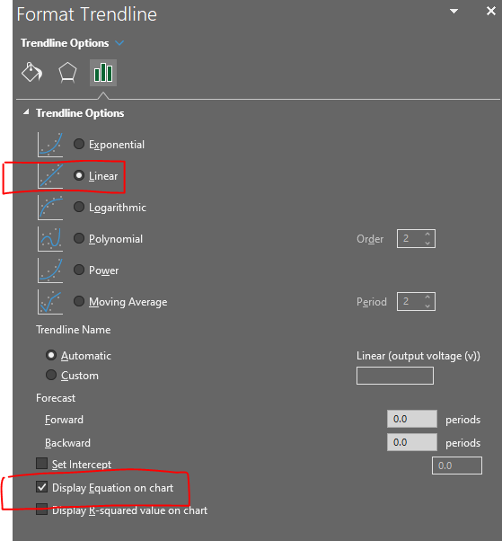

## Learning goals

- Create scripts and functions in Blockly

- Learn and practice:

  - How to calibrate a sensor

  - How to find the characteristic curve of a sensor

## Software and hardware

- BlocklyProp Solo

- Activity Board and Parallax USB programming cable

- PAR sensor

- Calibrated PAR sensor - Quantum meter

**What is PAR?**

Photosynthetically active radiation (PAR), which is solar radiation ranging from 400 to 700 nm, is the most important energy source for crops, used by them for photosynthesis. A low or high PAR intensity can deteriorate photosynthesis; hence, it may become a stress factor.

# Background 

Sensor calibration is required to ensure accurate measurements by the sensor. Therefore, it is necessary to minimize the sensor's error, i.e., to minimize the difference between the measured value by the sensor and the actual value of the quantity being measured.

The purpose of calibration is to find or update the characteristic curve, which defines the relationship between the quantity being measured and the sensor's output. Calibration must be performed in a timely manner to prevent performance degradation and ensure accurate measurements. The performance of the sensor tends to degrade over time and change depending on the working environment; therefore, revisiting the characteristic curve is necessary.

# Multi-point curve fitting 

The objective of this assignment is to calibrate the PAR sensor, which returns the raw number. The goal is to find a characteristic curve that maps the light intensity in µmol/(m^2^s) to the sensor's output. Here are the calibration steps:

1.  Take a few measurements with the PAR sensor, preferably one near the low end, one near the high end, and a few measurements in between. For the low-light intensity measurement, we can keep the cap on the sensor and take a measurement. Then, we can take measurements at various locations and times with different light intensities. For example, one measurement can be taken outside around noon, when the light intensity is at its maximum, and another in the shade.

2.  Repeat the above measurements with the reference instrument, which can be a calibrated sensor. These are the actual values for our measurements. Please note that each measurement at this step should be taken simultaneously and under the same conditions as the corresponding measurement in Step 1.

. Taking measurements with calibrated and uncalibrated sensors at the same time and under the same lighting conditions. The calibrated sensor is an Apogee MQ-200X Quantum Separate Sensor with Handheld Meter, which returns light intensity in µmol/(m^2^s).

3.  Record the measurements of both calibrated and uncalibrated sensors in a table, similar to Table 1.

  --------------------------------------------------------------------------------
   **light intensity (micromole/(m^2^s))**   **Sensor outcome (volt-hundredths)**
  ----------------------------------------- --------------------------------------
                      0                                       0

                     109                                      24

                     336                                      80

                     657                                     153

                     885                                     195

                    1120                                     250

                    1392                                     304

                    1707                                     376
  --------------------------------------------------------------------------------

  : . Example of light intensity measurements using a calibrated sensor and an uncalibrated PAR sensor.

4.  Plot the sensor's measurements versus the actual light intensity measured by the calibrated sensor.

In Excel: Select the two columns \> insert tab \> Charts \> Scatter.

<figure>

<figcaption>
. How to plot a scatter plot in Excel.
</figcaption>
</figure>

5.  Fit a model (typically a linear function) to the points in Excel.

> In Excel:

- Right click on one of the points \> add trendline \> a new window pops up, then

  - Select the linear model

  - Select "Display Equation on Chart"

  - Select "Display R-squared value on chart"

 

. How to fit a linear trendline in Excel and get the equation.

At this point, we fitted a linear model/function (y = Ax + B) that defines the relationship between light intensity and the output of the PAR sensor. This is the characteristic curve of this PAR sensor. In this equation, 'x' denotes light intensity, and 'y' refers to the sensor output.

- Calculate the inverse of the equation returned by Excel. The inverse model maps the sensor output (x) to light intensity (y).

Here is an example:

> y = 3x + 4 🡺 this is f(x).
>
> 3x = y -- 4
>
> x = (y-4)/3
>
> x = (1/3)y -- 4/3
>
> swap x and y:
>
> y = (1/3)x -- 4/3 🡺 this is the inverse of our function f(x).

- Using the inverse model, complete the following table by calculating the light intensity for the following sensor's measurements:

  -----------------------------------------------------------------------------------------------------------------------------------------------------------------------------------------
   sensor outcome (raw values)   Calibrated values for sensor output (µmol/(m^2^s))   Actual measurement (µmol/(m^2^s))   Error (actual measurement - Calibrated values for sensor output)
  ----------------------------- ---------------------------------------------------- ----------------------------------- ------------------------------------------------------------------
                8                                                                                    52                  

               77                                                                                    415                 

               130                                                                                   584                 

               212                                                                                   942                 

               251                                                                                  1101                 
  -----------------------------------------------------------------------------------------------------------------------------------------------------------------------------------------

  : . Calibrated values for sensor output are calculated based on the inverse function vs actual measurements.

# Two-point calibration

Use the first and last row of Table 1 (the two extreme values) to find a new calibration model using the two-point calibration equation (for more information, please refer to the slides):

$$corrected\ value = (raw\ value\  - RawLow) \times \left( \frac{ReferenceRange}{RawRange} \right) + ReferenceLow$$

Please note that RawLow and ReferenceLow are both equal to zero (Table 1), so the equation becomes:

$$corrected\ value = (raw\ value\ ) \times \left( \frac{ReferenceRange}{RawRange} \right)$$

We can even further simplify the equation by plugging the range values. Now, you can calculate the calibrated value using the following equation:

$$\ corrected\ value = \left( \frac{1707}{376} \right)\  \times (raw\ value\ )$$

- Using the equation obtained by two-point calibration, complete the table again:

  -----------------------------------------------------------------------------------------------------------------------------------------------------------------------------------------
   sensor outcome (raw values)   Calibrated values for sensor output (µmol/(m^2^s))   Actual measurement (µmol/(m^2^s))   Error (actual measurement - Calibrated values for sensor output)
  ----------------------------- ---------------------------------------------------- ----------------------------------- ------------------------------------------------------------------
                8                                                                                    52                  

               77                                                                                    415                 

               130                                                                                   584                 

               212                                                                                   942                 

               251                                                                                  1101                 
  -----------------------------------------------------------------------------------------------------------------------------------------------------------------------------------------

  : . Calibrated values for sensor output calculated based on the two-point calibration method vs actual measurements.

- Calculate the root mean square error (RMSE) for the two calibration techniques using the following equation:

*\*
$$RMSE = \ \sqrt{\frac{1}{N}\ \sum_{i = 1}^{N}{(y_{i}\  - \ {\widehat{y}}_{i})}^{2}}$$

$$y_{i}:\ Actual\ measurement\ $$

$${\widehat{y}}_{i}:\ Calibrated\ values\ for\ sensor\ output\ $$

How to do it in Excel:

- Add a new column and raise the error to the power of 2.

- Calculate the sum of the errors you raised to the power of 2.

- Divide the sum by the total number of samples, which is 5 in this case.

- Calculate the square root of the value you obtained after dividing by 5.

# 

1.  Please submit your measurements that are entered into Table 1. (no points)

2.  Please submit the scatter plot showing the equation of the characteristic curve

you obtained after fitting a linear model? (20 points)

3.  What is the inverse of the characteristic curve? (10 points)

4.  Please complete both Table 2 and Table 3 and submit them. (20 points)

5.  What is the RMSE for each calibration technique? What technique has the lower RMSE? (10 points)

6.  What is the sensitivity of the sensor, and what is its unit? (10 points)

7.  Does the sensor have an offset (bias)? If so, specify the bias. (10 points)

8.  If the maximum output voltage of the sensor is 5V (which is read as 500 by the Blocklyprop, volt-hundredths), what is the maximum light intensity that the sensor can measure in µmol/(m2s)? (10 points)

9.  Plot the calibrated values for sensor output calculated based on the inverse function vs actual measurements (Table 2). Add a trendline to the points. What is the slope of the trendline? What is an ideal slope for such a line that maps the measured values to the actual values? (10 points)

\*\* Please submit your responses as a word/PDF file.
