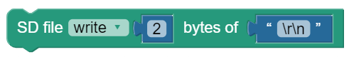
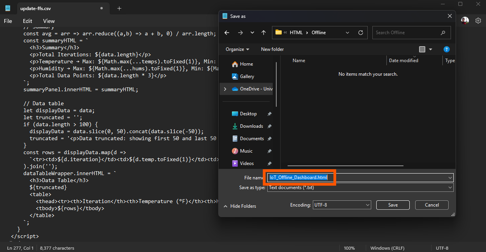
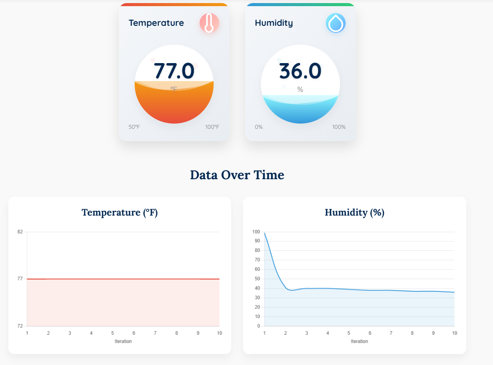
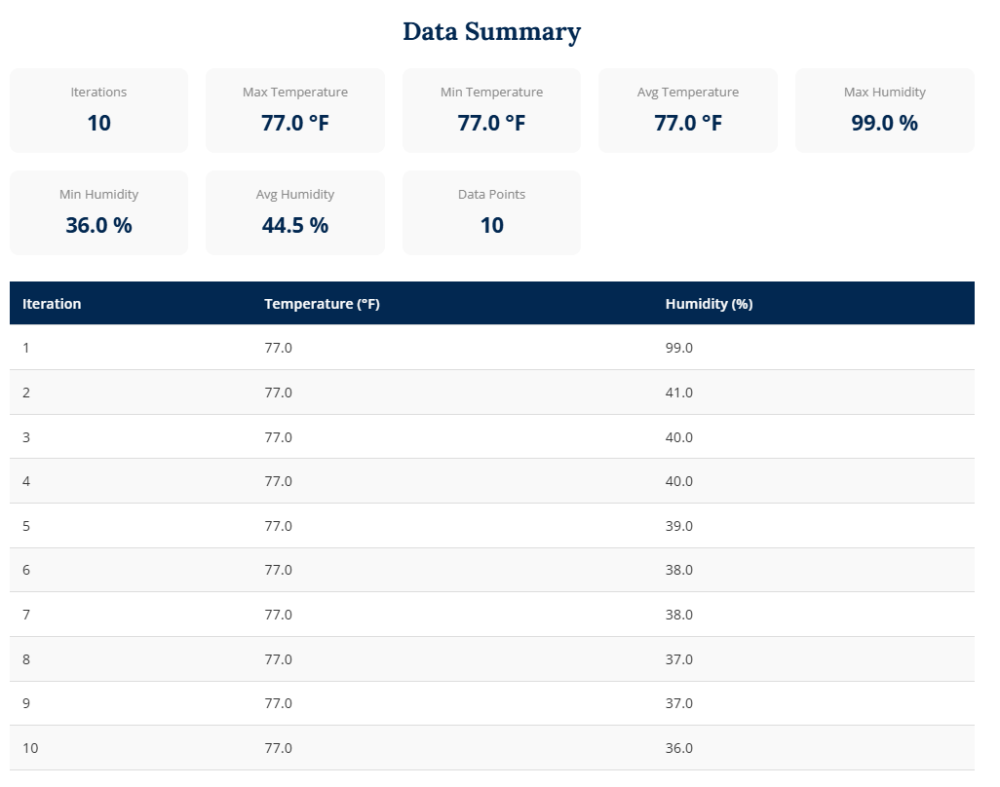
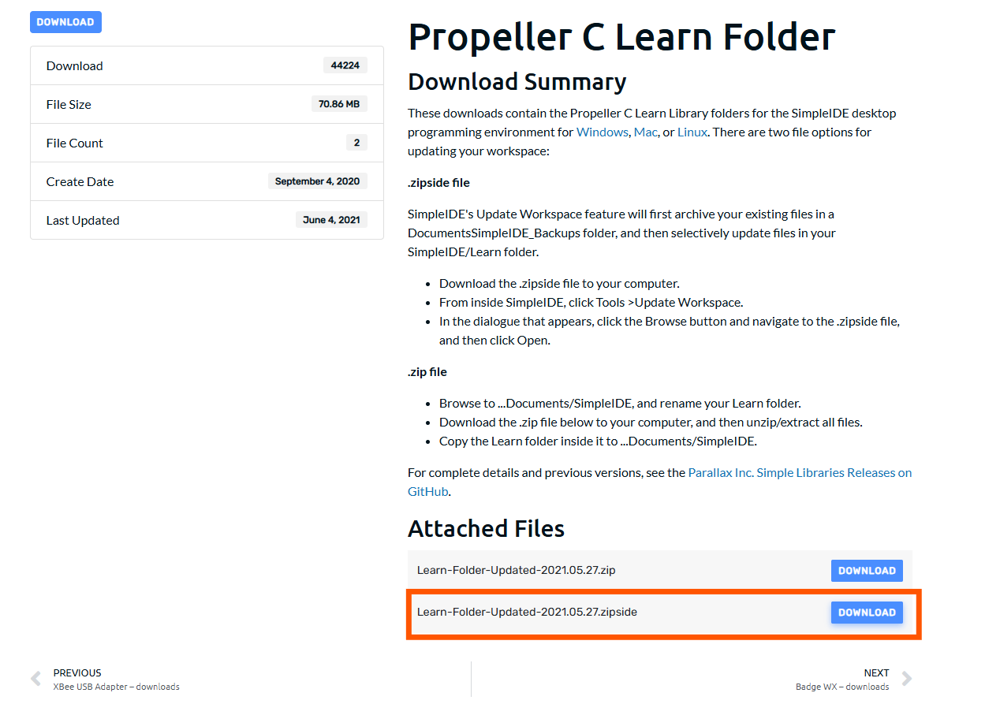
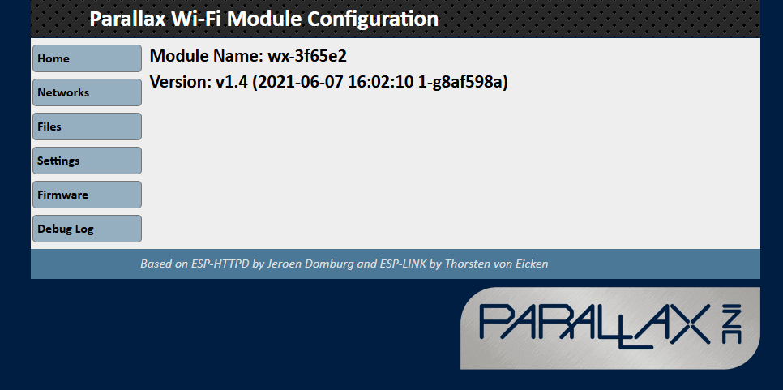
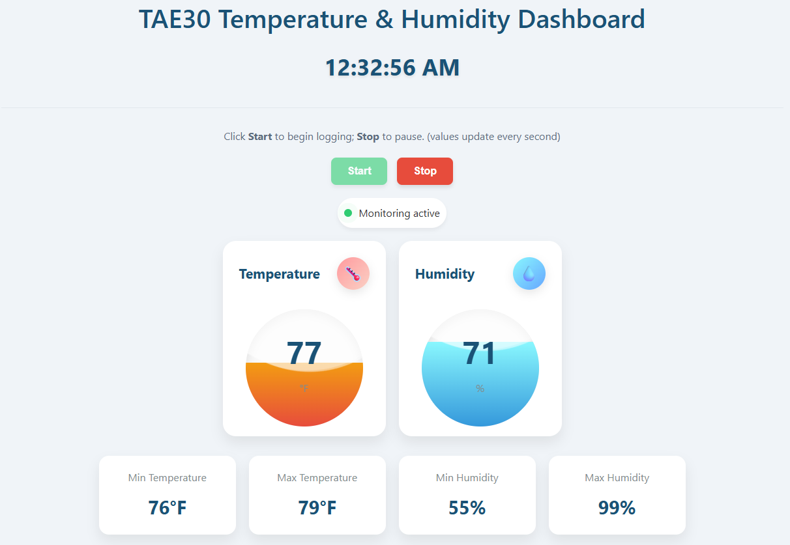

## Learning goals

- **Real-time data logging in Blockly --** build a Blockly program that, once per second, prints iteration, temperature, humidity to the serial terminal in comma-separated format.

- **SD-card data capture --** store the same iteration/temperature/humidity records on an SD card and practice moving the card to a computer to retrieve the file.

- **HTML IoT dashboard creation --** use ChatGPT to generate an HTML page that lets you upload the CSV file and displays a concise summary of the data offline.

- **Live web publishing with the WX Wi-Fi Module --** update and configure the WX module, then combine Simple IDE and your HTML to serve a real-time IoT dashboard over Wi-Fi.

## Software and Hardware

- BlocklyProp Solo

- Activity Board and Parallax USB programming cable

- DHT22 Sensor

- WX Wi-fi Module ESP8266

- SD Card

- SD Card Reader

- Ruler or Measuring Tape

- Notepad

# SD Card Data

Your ActivityBot board (original or WX version) has a built-in card reader that is compatible with our preformatted microSD card. SD cards can give your Propeller microcontroller invention some extra gigabytes of memory to work with. In this lesson, we'll look at simple data storage and retrieval. (reference:<https://learn.parallax.com/tutorials/language/propeller-c/propeller-c-simple-devices/sd-card-data>)

  ------------------------------------------------------------------------------------------------------------------------------------------------------------------------------------------------------------
  
  ------------------------------------------------------------------------------------------------------------------------------------------------------------------------------------------------------------
  Figure 1. Buit-in card reader for microSD Card.

  ------------------------------------------------------------------------------------------------------------------------------------------------------------------------------------------------------------

**[DHT22 Temperature & Humidity Sensor]{.underline}**

The DHT22 (also sold as AM2302) is a combined digital-output sensor that reports both ambient temperature (-40 °C -- 80 °C, ±0.5 °C) and relative humidity (0 -- 100 %, ±2 %). A built-in 12-bit ADC and calibrated signal processor let it stream accurate readings through a single‐wire data line---perfect for microcontroller projects that need reliable environmental data.

**How to connect the DHT22 to the Propeller Activity Board WX**

1.  **Locate the Temp / RH socket:** On the Activity Board WX, the header highlighted in Figure 1 is silkscreened "TEMP RH" and is internally mapped to [I/O-pin 14.]{.underline}

2.  **Plug in the sensor:** Slide the connector from the sensor cable straight onto the TEMP RH header.

  ----------------------------------------------------------------------------------------------------------------------------------------------------------------------------------------------------------
  
  ----------------------------------------------------------------------------------------------------------------------------------------------------------------------------------------------------------
  Figure 2 -- DHT22 connected to the Activity Board WX (TEMP RH header, pin 14). The red rectangle highlights the TEMP RH socket where the sensor cable is plugged in.

  ----------------------------------------------------------------------------------------------------------------------------------------------------------------------------------------------------------

# Blockly Coding for Saving Data

**1 Setup and user input**

- **In terminal ask the user**"How many measurements would you like to take?"

  - Drop a *Terminal print text* block for the question.

  - Follow it with a *Terminal receive number* block to capture the reply and store it in a variable (e.g., **totalSamples**).

**2 Create the CSV file on the SD card**

- Insert an *SD file open* block: open---or create---data.csv in **read-write** mode.

- Write a single header line to the file:\
  iteration,temperature,humidity

  - easiest: *Create string from text* ("iteration,temperature,humidity") → *SD file write* → *write newline*.

- Echo that same header to the Terminal so the user sees the column labels.

**3 Main measurement loop**

Use a *repeat ... times* loop that runs exactly **totalSamples** times.

Inside the loop, in this order:

1.  **Take a reading**

    - Drop a *Temp & Humidity read PIN 14* block twice---once to fetch temperature (°F) and once for relative humidity (%).

2.  **Format the reading as CSV**

    - Build a string that joins\
      current iteration number, a comma, temperature, a comma, humidity.\
      Example result: 3,72,54

3.  **Show it live**

    - Use *Terminal print* (or *Terminal print text*) to send that CSV line to the screen, followed by a newline.

4.  **Save it**

    - Use *SD file write* to append the same line to data.csv, then add a newline (\\r\\n) so the next record starts fresh.

5.  **Increment the counter**

    - Add 1 to your iteration variable.

6.  **Pause one second**

    - Insert a *pause (ms) 1000* block so readings are exactly one second apart.

**4 Wrap-up**

- After the loop finishes, close the CSV file with *SD file close*---this guarantees the data is written properly.

- Print a friendly message such as "Logging complete. File saved to SD card." so the user knows the program is done.

**What you should see in blockly terminal**

  -----------------------------------------------------------------------------------------------------------------------------------------------------------------------------------------------------------
  
  -----------------------------------------------------------------------------------------------------------------------------------------------------------------------------------------------------------
  Figure 3. Terminal transcript showing the header plus ten temperature-humidity samples, followed by the "Saved." confirmation after the data are logged to data.csv

  -----------------------------------------------------------------------------------------------------------------------------------------------------------------------------------------------------------

**What you should see in the saved .CSV file**

  -----------------------------------------------------------------------------------------------------------------------------------------------------------------------------------------------------------
  
  -----------------------------------------------------------------------------------------------------------------------------------------------------------------------------------------------------------
  Figure 4. Contents of data.csv opened in Excel: the three columns (Iteration, Temperature, Humidity) with ten logged readings ready for analysis.

  -----------------------------------------------------------------------------------------------------------------------------------------------------------------------------------------------------------

# Blockly Saveing Related Blocks

  ---------------------------------------------------------------------------------------------------------------------------------------------------------------------------------------------------------------------------------------------------------------------------------------------------------------------------------------------------------------------------------------------------------------------------------------------------------------------------------------
  Use the following block to open an empty CSV file for reading and writing data.                                                                                                                                                                                            
  ------------------------------------------------------------------------------------------------------------------------------------------------------------------------------------------------------------------------------------------------------------------------- -------------------------------------------------------------------------------------------------------------------------------------------------------------------------------------------------------------
  Use this block to convert all data types to string, which is mandatory for the saving process. Additionally, this block will combine Actual Data, Laser Ping data, and Ultrasonic data. It\'s necessary to include a comma between each to save them in separate cells.    

  Use this block to calculate the length of your string and save each byte of your data accordingly.                                                                                                                                                                         

  Use this block to move to the next row after saving data, ensuring that data from each measurement is stored on a separate line.                                                                                                                                            

  Use this block to close the file after all data has been saved, ensuring that the data is securely stored and the process is properly completed after the end of the loop.                                                                                                 
  ---------------------------------------------------------------------------------------------------------------------------------------------------------------------------------------------------------------------------------------------------------------------------------------------------------------------------------------------------------------------------------------------------------------------------------------------------------------------------------------

# Build the HTML Dashboard with ChatGPT

Now that you've collected your measurements into data.csv with this structure:

  ------------------------------------------------------------------------
  **Iteration**        **Temperature**               **Humidity**
  -------------------- ----------------------------- ---------------------
  1                    75                            58

  2                    75                            57

  3                    75                            56

  ...                  ...                           ...

  10                   75                            54
  ------------------------------------------------------------------------

it's time to generate a self-contained HTML dashboard. We'll prompt ChatGPT with everything it needs to know about our data format and desired features. Feel free to tweak the wording or add your own styling ideas.

**ChatGPT Optimized Prompt:**

You are a frontend engineer.

TASK

Write a single, self-contained \*\*HTML file\*\* (no external JS/CSS files) that fulfils all requirements below.

Return \*only\* the code block -- no explanations.

INPUT FILE

• The user drags-and-drops OR selects a CSV file.

• The first row is a header with the exact names:

Iteration Temperature Humidity

(Columns may be comma \*\*or\*\* tab separated; values are integers or floats.)

WHAT THE PAGE MUST DO

1\. When a valid CSV is loaded:

• Hide the "no-data" placeholder and show the dashboard.

• Parse the file, ignoring blank lines.

2\. Display two stylish cards (or gauges) side-by-side showing the \*\*latest\*\*:

-- Temperature value (°F) with a thermometer icon

-- Humidity value (%) with a droplet icon

Each card should have a colored liquid-fill or wave animation whose height reflects the current value (temperature mapped 50→0 % to 100→100 %; humidity 0 %→0 %, 100 %→100 %).

3\. Plot two separate line charts with \*\*Chart.js 4.x\*\* (via CDN):

• Temperature vs Iteration

• Humidity vs Iteration

X-axis label: "Iteration".

4\. Show a \*\*summary grid\*\* with:

-- Iterations (count)

-- Max / Min / Avg Temperature

-- Max / Min / Avg Humidity

-- Data points (total rows)

5\. Show a \*\*table\*\* of the readings below the summary.

• If \> 100 rows, show the first 50 + last 50 rows and add a note.

6\. All text & numbers should be formatted with 1 decimal place where appropriate.

7\. Styling:

• Use CSS variables for a simple UC-Davis-like palette

↳ primary #022851, secondary #FFBF00, accent blue #8FA8C5.

• Rounded cards, subtle shadows, responsive layout (cards stack on ≤ 768 px).

8\. Keep all JS in a \`\<script\>\` tag at the bottom; \*no\* external build tools.

9\. Fail gracefully: if the file isn't CSV or columns are missing, alert the user.

OUTPUT FORMAT

Return one fenced code block with the complete HTML (incl. CSS & JS).

Do NOT include any narrative or markdown outside the code block.

**[Saving and Running Your Offline Dashboard]{.underline}**

1\. **Open a plain‐text editor**

- (e.g. Notepad on Windows, TextEdit on macOS in plain‐text mode, or any code editor).

2\. **Paste the ChatGPT-generated HTML** into a new file.

**3. Save with an .html extension**

- In the "Save as type" dropdown choose **All Files**.

- Name your file something like IoT_Offline_Dashboard.html.

- Click **Save** (see Fig. 5).

4\. **Launch the dashboard**

- Find the saved .html file and double-click it to open in your default browser.

5\. **Load your data**

- Drag-and-drop (or use the file picker) to upload your data.csv.

- The page will parse and render gauges, charts, a summary panel, and the data table---all offline (see Fig. 6).

  ----------------------------------------------------------------------------------------------------------------------------------------------------------------------------------------------
  
  ----------------------------------------------------------------------------------------------------------------------------------------------------------------------------------------------
  Figure 5. Saving the HTML as a .html file so your browser recognizes and renders it as a webpage.

  ----------------------------------------------------------------------------------------------------------------------------------------------------------------------------------------------

+------------------------------------------------------------------------------------------------------------------------------------------------------------------------------------------------------------+-------------------------------------------------------------------------------------------------------------------------------------------------------------------------------------------------------------+
|  |  |
+:===========================================================================================================================================================================================================+:============================================================================================================================================================================================================+
| Figure 6. The offline dashboard in action: live‐style gauges, line charts, summary metrics, and a data table after loading the CSV.                                                                                                                                                                                                                                                                                      |
+--------------------------------------------------------------------------------------------------------------------------------------------------------------------------------------------------------------------------------------------------------------------------------------------------------------------------------------------------------------------------------------------------------------------------+

**Note:** You're welcome to use my example dashboard as a visual reference when crafting your ChatGPT prompt. Just visit:

<https://mohammadrezanarimaniucdavis.github.io/TeachingResources/TAE30TempHumidyOffline.html>

then after uploading your csv file, take screenshots of any elements you like---icons, layout, color scheme, wave animations---and paste them into your prompt to steer ChatGPT toward your ideal design.

**[Online Dashboard & SimpleIDE Setup]{.underline}**

**1. Update SimpleIDE Workspace**

By default, SimpleIDE doesn't include the DHT22 library. Follow these steps to install the updated "Learn" folder:

1.  **Download the updated workspace archive**

    - Go to:\
      [[https://www.parallax.com/package/propeller-c-learn-folder/]{.underline}](https://www.parallax.com/package/propeller-c-learn-folder/)

    - Click **Learn-Folder-Updated-2021.05.27.zipside** and save to your PC.

    - *Fig. 7 shows the download link.*

  -----------------------------------------------------------------------------------------------------------------------------------------------------------------------------------------------------------
  
  -----------------------------------------------------------------------------------------------------------------------------------------------------------------------------------------------------------
  Figure 7. Download .zipside file to update all libraries in Simple IDE

  -----------------------------------------------------------------------------------------------------------------------------------------------------------------------------------------------------------

2.  **Import into SimpleIDE**

    - Launch SimpleIDE.

    - From the top ribbon choose **Tools → Update Workspace...**

    - In the file browser, select the **.zipside** you just downloaded.

    - Click **Open** to apply the update.

    - *See Fig. 8 for the menu path.*

+------------------------------------------------------------------------------------------------------------------------------------------------------------------------------------------------------------+------------------------------------------------------------------------------------------------------------------------------------------------------------------------------------------------------------+
|  |  |
+:===========================================================================================================================================================================================================+:===========================================================================================================================================================================================================+
| Figure 8. Update libraries in Simple IDE by uploading .sipside file                                                                                                                                                                                                                                                                                                                                                     |
+-------------------------------------------------------------------------------------------------------------------------------------------------------------------------------------------------------------------------------------------------------------------------------------------------------------------------------------------------------------------------------------------------------------------------+

3.  **Restart SimpleIDE**

    - Close and re-open SimpleIDE to ensure the new libraries (including DHT22) are available.

**2. Load the Code**

1.  **Create a new project**

    - In SimpleIDE, open a new C file (e.g. **TAE30_Temp_RH_Online.c**).

2.  **Paste the sensor-to-web code**

    - You can find the code in Canvas, titled "TAE30_Temp_RH_Online.c"

**3. Hardware Setup**

- Move the PCB jumper so it connects **3.3 V → SEL** (this powers the WX module).

- Plug the **WX Wi-Fi Module** into its header on the Activity Board.

- Insert the **DHT22 sensor** into the TEMP/RH socket (pin 14).

- Verify module orientation and jumper position match **Fig. 9**.

  -----------------------------------------------------------------------------------------------------------------------------------------------------------------------------------------------------------
  
  -----------------------------------------------------------------------------------------------------------------------------------------------------------------------------------------------------------
  Figure 9. Hardware configuration: WX Wi-Fi module mounted, DHT22 sensor installed, and jumper positioned between 3.3 V and SEL.

  -----------------------------------------------------------------------------------------------------------------------------------------------------------------------------------------------------------

**4. Configure the WX Wi-Fi Module**

1.  **Download the latest firmware**

    - Go to:\
      <https://www.parallax.com/package/parallax-wx-downloads/>

    - Download **Parallax_WiFi_Firmware_ESP8266_v1.4.zip**

    - *Fig. 10 shows the firmware file to grab.*

  ----------------------------------------------------------------------------------------------------------------------------------------------------------------------------------------------------------
  
  ----------------------------------------------------------------------------------------------------------------------------------------------------------------------------------------------------------
  Figure 10. Locate and download the ESP8266 firmware ZIP.

  ----------------------------------------------------------------------------------------------------------------------------------------------------------------------------------------------------------

2.  **Enter the module's setup mode**

    - On the Activity Board, press the **RST** button **four times** in quick succession.

    - Within a few seconds, your PC's Wi-Fi list will show a new SSID beginning with wx- (e.g. wx-3f65e2).

    - *See Fig. 11 for the hotspot name.*

  ----------------------------------------------------------------------------------------------------------------------------------------------------------------------------------------------------------
  
  ----------------------------------------------------------------------------------------------------------------------------------------------------------------------------------------------------------
  Figure 11. The WX module's initial access-point SSID.

  ----------------------------------------------------------------------------------------------------------------------------------------------------------------------------------------------------------

3.  **Open the Parallax web UI**

    - Connect your computer to the wx-xxxxx network.

    - Your browser should automatically load the Parallax configuration page (or go to http://192.168.4.1).

    - *Refer to Fig. 12.*

  -----------------------------------------------------------------------------------------------------------------------------------------------------------------------------------------------------------
  
  -----------------------------------------------------------------------------------------------------------------------------------------------------------------------------------------------------------
  Figure 12. Parallax Wi-Fi module configuration portal.

  -----------------------------------------------------------------------------------------------------------------------------------------------------------------------------------------------------------

4.  **Upload the new firmware**

    - In the web UI, click the **Firmware** tab.

    - Unzip **Parallax_WiFi_Firmware_ESP8266_v1.4.zip**, select httpd.ota and click **Update**.

    - Wait for the "Upload done. Rebooting..." confirmation.

    - *Fig. 13 shows a completed firmware update.*

  ------------------------------------------------------------------------------------------------------------------------------------------------------------------------------------------------------------
  
  ------------------------------------------------------------------------------------------------------------------------------------------------------------------------------------------------------------
  Figure 13. Firmware upload in progress, then success.

  ------------------------------------------------------------------------------------------------------------------------------------------------------------------------------------------------------------

5.  **Join your home network**

    - In Networks, switch the Wi-Fi mode to **STA + AP**.

    - Select your personal Wi-Fi or phone hotspot (do **not** choose eduroam).

    - Enter your SSID and password, then click **Connect**.

    - The UI will display **"Connected"** and an **assigned IP address**.

    - *See Fig. 14 for a successful network join.*

  ------------------------------------------------------------------------------------------------------------------------------------------------------------------------------------------------------------
    
  ------------------------------------------------------------------------------------------------------------------------------------------------------------------------------------------------------------
   

                                                                     Figure 14. WX module connected in STA+AP mode, showing its IP address.
  ------------------------------------------------------------------------------------------------------------------------------------------------------------------------------------------------------------

**5. Launch the Online Dashboard**

1.  **Upload the dashboard HTML**

    - Download **mypage.html** from Canvas (the course template).

    - In the Parallax web UI, switch to the **Files** tab.

    - Click **Choose File**, select mypage.html, and upload.

    - *Fig. 15 shows the upload dialog.*

  ------------------------------------------------------------------------------------------------------------------------------------------------------------------------------------------------------------
  
  ------------------------------------------------------------------------------------------------------------------------------------------------------------------------------------------------------------
  Figure 15. Uploading mypage.html to the WX module.

  ------------------------------------------------------------------------------------------------------------------------------------------------------------------------------------------------------------

2.  **Preview the dashboard**

    - In your browser, go to:

> http://192.168.4.1/files/mypage.html

- You'll see the static dashboard layout (no live data yet).

- *Refer to Fig. 16.*

  -----------------------------------------------------------------------------------------------------------------------------------------------------------------------------------------------------------
   
  -----------------------------------------------------------------------------------------------------------------------------------------------------------------------------------------------------------
   

                                                                          Figure 16. Dashboard template loaded---awaiting live data.
  -----------------------------------------------------------------------------------------------------------------------------------------------------------------------------------------------------------

3.  **Select the WX serial port**

    - In SimpleIDE's bottom‐left corner, change the COM port from your PC's USB port (e.g. COM3) to the **wx-xxxxx** port.

    - *See Fig. 17.*

  ------------------------------------------------------------------------------------------------------------------------------------------------------------------------------------------------------------
  
  ------------------------------------------------------------------------------------------------------------------------------------------------------------------------------------------------------------
  Figure 17. Choosing the WX module's serial port in SimpleIDE.

  ------------------------------------------------------------------------------------------------------------------------------------------------------------------------------------------------------------

4.  **Run the sensor‐to‐web program**

    - Click **Run with Terminal** in SimpleIDE.

    - Wait for the build to complete and the terminal shows a blank page.

    - *Fig. 18 shows a successful build and serial activity.*

  ------------------------------------------------------------------------------------------------------------------------------------------------------------------------------------------------------------
  
  ------------------------------------------------------------------------------------------------------------------------------------------------------------------------------------------------------------
  Figure 18. SimpleIDE running the online monitor code.

  ------------------------------------------------------------------------------------------------------------------------------------------------------------------------------------------------------------

5.  **Start live updates**

    - Return to http://192.168.4.1/files/mypage.html in your browser.

    - Click the **Start** button on the page.

    - The dashboard will now poll /tpfm every second and update the gauges, charts, and table in real time.

    - *See Fig. 19 for live data streaming.*

  ------------------------------------------------------------------------------------------------------------------------------------------------------------------------------------------------------------
   
  ------------------------------------------------------------------------------------------------------------------------------------------------------------------------------------------------------------
   

                                                                 Figure 19. Online IoT dashboard fetching temperature & humidity every second.
  ------------------------------------------------------------------------------------------------------------------------------------------------------------------------------------------------------------

Enjoy your first live IoT dashboard!

1.  **Offline Version (100 points total)**

- Save your Blockly code as an **.svg** (showing iteration, temperature, and humidity in the terminal, and logging data to the SD card) and upload it to Canvas. **(50 points)**

- Save your **CSV file**---containing iteration, temperature, and humidity readings every second---and upload it to Canvas. **(20 points)**

- Save your **Offline Monitoring Dashboard** HTML code and upload it to Canvas. **(20 points)**

- Take screenshots of different parts of your offline dashboard and upload them to Canvas. **(10 points)**

2.  **Online Version** **(Bonus 20 points total)**

- Take a screenshot of your WX Wi-Fi Module successfully connected to your local network or phone hotspot, showing the assigned IP address. **(10 points)**

- Take a screenshot of the live online IoT dashboard continuously logging data. **(10 points)**
