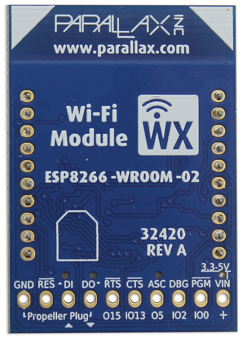

(section-label)=
## Parallax Propellor Board

(The content on this page has been developed thanks to the official Parallax [website](https://learn.parallax.com/support/reference/using-propeller-activity-board))

The Parallax Propeller Activity Board WX is an affordable and fully-featured development board designed for Propeller projects. It comes equipped with a mini solderless breadboard, expanded I/O headers, and both 3.3V and 5V power regulators, allowing users to easily build Kickstart demonstration projects or Propeller C tutorials.


- **Key Features**:
    - **Integrated Solderless Breadboard**: The board includes a mini solderless breadboard, facilitating projects with short jumper wires like the 100mm Male-Male Jumper Wires.

    - **Power Options**:
        - USB Cable: Power can be supplied via a USB cable during programming and testing. Note that USB ports typically provide up to 500 mA of current.
        - Separate Power Supply: Alternatively, a 6-9 volt battery pack or a power adapter delivering at least 1 amp at 6 to 9 volts can be used when untethered from a computer.

    - **3-Position Power Switch**: The board features a 3-position switch to control power distribution:
        - Position 0: Removes power from all power pin connections.
        - Position 1: Applies power to the breadboard power pins, excluding the six servo headers.
        - Position 2: Applies power to both the breadboard pins and the servo headers.
    - **Using Servo Headers**: The servo headers facilitate easy testing of Parallax continuous or standard servo motors. Additional information is available in the documentation.
    - **Adapting Wiring Diagrams**: Wiring diagrams from Kickstart projects can be adapted for use with the Propeller Activity Board. Depending on the original diagram:

If you are interested, you can learn more about the board here:
- [Parallax Propellor Board](../images/book/hardware/board.png)

(section-label)=
## Parallax WX Wi-Fi Module for Prop C

This Wi-Fi module connects to your Propeller Activity Board, allowing you to open up the possibility of priojects using interactive internet and web features. 



### Wi-Fi Module Firmware

- Go to the Parallax Wi-Fi Module Firmware and Example Files [download page](https://www.parallax.com/downloads/parallax-wi-fi-module-firmware-and-example-files)
- Download the most recent version (highest version number) 32420-Parallax-ESP…zip
- Unzip to a folder and make sure the words Parallax ESP and the version number are in the folder name

### Connect Wi-Fi Module to Propeller Board

- Set the board's power switch to 1
- Run an example program like this one to test the module's firmware and communication with the Propeller board:

```c
/*
  Hello Message.c

  Display a hello message in the serial terminal.

  http://learn.parallax.com/propeller-c-start-simple/simple-hello-message
*/

#include "simpletools.h"                      // Include simpletools header

int main()                                    // main function
{
  print("Hello!!!");                          // Display a message
}
```

- Set the board's power switch to 0
- Make sure the corners of the module with white triangles are to the left
- Line up the module pins with the sockets.
- Press down firmly so that the Wi-Fi module sinks into the socket.


### Join Module's Wi-Fi

### Update Module Firmware

### Configure Module Communication

### Program the Propeller over Wi-Fi

### Load and View a Test Page

### Test the Propeller to Webpage Communication

### Join another Wi-Fi Network