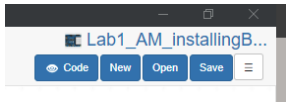

# Installing BlocklyProp Solo
**Due:** April 11, 11:59 PM

## Lab 1

<h2 style="background-color: #008080; color: white;">Learning Goals</h2>

<ul>
    <li>Connect Parallax activity board to a computer</li>
    <li>Create a simple script in Blockly</li>
    <li>Run and save the script</li>
</ul>

<h2 style="background-color: #008080; color: white;">Software and Hardware</h2>

<ul>
    <li>BlocklyProp Solo</li>
    <li>Activity Board</li>
    <li>Parallax USB programming cable</li>
</ul>

### Instructions
Please follow the instructions on the [website](https://learn.parallax.com/tutorials/language/blocklyprop/getting-started-blocklyprop-solo).
- This assignment has three steps shown on the top left. Please follow the instructions for each step. Please start from the first one (BlocklyProp Launcher). You can then go to the next step either by clicking on the top left menu (Connect and Program) or simply by clicking on the menu (Connect and Program) shown at the bottom of the page.
Alternatively, you can follow the steps in through this markdown [page](blocklyprop.md)

### Step 1. BlocklyProp Launcher
- Download and install the BlocklyProp Launcher Installer for your operating system.
- Name your project appropriately. For instance, you may want to name it as: Lab1_YourInitials_DescriptiveName
(e.g., Lab1_AM_installingBlocklyprop)

### Step 2. Connect and Program
- Once you connect the USB cable, from the port dropdown menu in the software (shown below), select the COM (communication) port connected to your Propeller board.

### Step 3. Saving Projects
- Pay attention to the difference between RAM and EEPROM.
- Save your project. It is saved as *.svg file. Every time you save the project, it adds a number at the end and saves it, unless you overwrite on the previous version.

### Notes on Installation, Troubleshooting, and Programming
**Download the USB Driver**
- Please make sure you accept default installation with FTDI drivers once you are installing BlocklyProp Solo.
- If the system doesn’t detect the device connected via USB, then follow these steps:
  - Install Parallax FTDI USB Drivers
  - [Parallax FTDI USB Drivers for Windows](https://www.parallax.com/package/parallax-ftdi-usb-drivers-for-windows/)
  - [Mac FTDI USB Driver](https://www.parallax.com/package/mac-ftdi-usb-driver/)

**Programming**
1. Create a block of code that prints the following texts in a new line in the terminal:
   - Add a comment as the first line of the code saying, ‘TAE 30’.
   - Add another comment in the next line: ‘Lab 1’.
     NOTE: the comments are not printed in the terminal. Comments are used to annotate the code and make it easier to understand for yourself when you get back to your code later and also for others when you share your code with them.
   - Print the following statements, each in a new line:
     - Hello!
     - A blank line to leave a space between the first and second line.
     - Your name (e.g., “My name is Ali Moghimi”)
     - A fun statement (e.g., ‘I love ice cream!’)
2. Save your code on your computer.

### What to Submit
- A screenshot of your code and the terminal showing the printed statements. Please note the project name with your initials should be visible in the screenshot (similar to the screenshot below).

